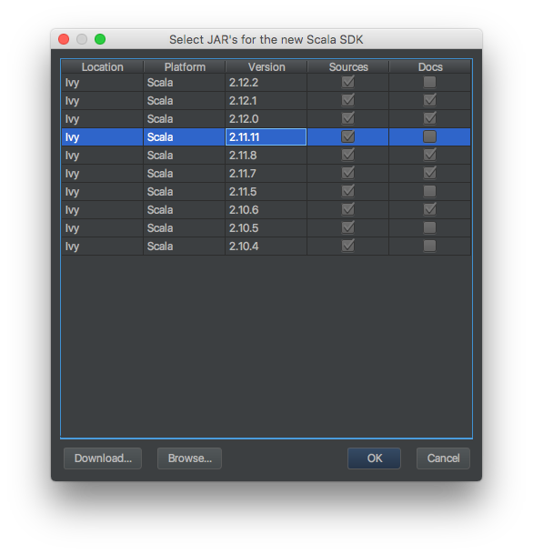

name: Getting Started
number: 00
layout: true
class: center, middle, inverse
---
# Getting Started
PlayFramework Tutorial 00

Noriaki Horiuchi, 2017

---
layout:false
## Agenda

- Install JDK
  - Set JAVA_OPTS

- Install sbt
  - Set SBT_OPTS
  - Install useful sbt plugins


---
## Install JDK

[Click here to download JDK](http://www.oracle.com/technetwork/java/javase/downloads/jdk8-downloads-2133151.html)

または

```
brew cask install java
```

---
## Install sbt

```
brew install sbt
```

---
## Install IntelliJ IDEA (Ultimate)

[Click here to download IntelliJ](https://www.jetbrains.com/idea/download)

- IntelliJ IDEA Ultimate を選んでインストールしてください
- 追加でプラグインをインストールしますか？と聞かれます。その中に Scala Plugin が入っているので、忘れずにインストールしてください。

---
## Create PlayFramework Project

- 作業フォルダを `~/play/` とします。
- 最終的にプロジェクトのルートディレクトリ `~/play/play-scala-seed/` に移動していればOKです。


```
mkdir play
cd play
sbt new playframework/play-scala-seed.g8
cd play-scala-seed
```

---
## Import Project to IntelliJ

1. IntelliJ を起動する
2. Import Project を選択する
3. play>play-scala-seed フォルダを選択して次画面へ
4. Import Project from… を選択し、SBT を選択して次画面へ
5. Library sources、SBT sources へチェックを入れ、インストールしたJDKを選択後 Finish

---
## Download Scala SDK
- `app/controllers/HomeController.scala` を開きます
- 上部に黄色いバーが表示され、ScalaのSDKが設定されていない旨表示されるので、バー右側のリンクを押す
- Scala 2.11.11 を選択してOK



