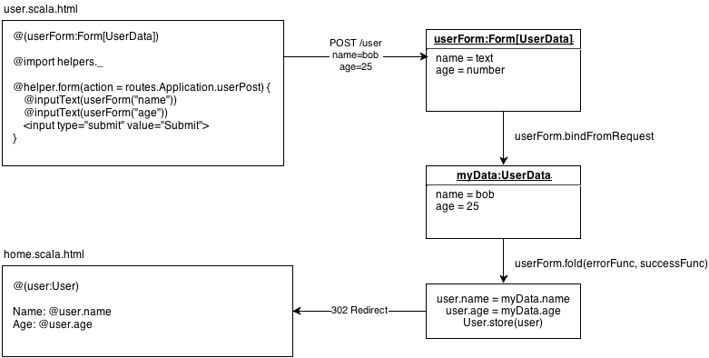

name: inverse
number: 03
layout: true
class: center, middle, inverse
---
# Form, Validation, I18n and DI

PlayFramework Tutorial {{ number }}

Noriaki Horiuchi, 2017

---
layout: false
## Agenda

### [Form and Validation](https://www.playframework.com/documentation/2.5.x/ScalaForms)
### [Custom Validation](https://www.playframework.com/documentation/2.5.x/ScalaCustomValidations)
### [I18n (Internationalization)](https://www.playframework.com/documentation/2.4.x/ScalaI18N)
### [DI (Dependency Injection)](https://www.playframework.com/documentation/2.4.x/ScalaDependencyInjection)

---
layout: true
## Form And Validation

---
### Lifecycle

---
### すること

- ToDo を作成（Create）、タイトルを変更（Update）する
- `title` の要件
    - 空でない（1文字以上）
    - 5文字以内

---
layout: true
## Custom Validation

---
### ToDo に期日を設定する

- 文字列で入力する
- 正しい形式でなければエラー
    - java.time API (Java 8 より追加：JSR310)

---
## すること
- テーブルのマイグレーション（期日カラムの追加）
- モデルの修正（変数を追加）
    - コントローラも修正
    - フォームにはまだ期日欄を設置しない
- 期日を設定できるようにビュー、フォームを改修
- カスタムバリデーションを作成

---
layout: true
## I18n

---
###  Internationalization
今回は日本語にだけ対応
日本語のメッセージを集めたファイルを作る
必要に応じてそれを取得する

- application.conf の修正
- messages.ja の作成

---
### Dependency Injection
- 「依存性の注入」
- 疎結合にしてテスト性・メンテナンス性を維持するためのしくみ
- PlayFramework は標準で Google の Guice を使用する

コントローラに MessagesApi を Inject するなどする
