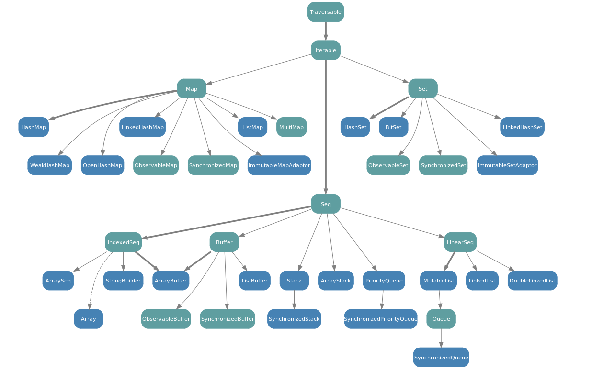

name: inverse
layout: true
class: center, middle, inverse
---
# Scala Collections

Noriaki Horiuchi, 2017

---
layout: false
## Agenda

- Collections
- Collections API

---
layout: true
## コレクション：5つの特長

---
- **簡単**
- **短い**
- **安全**
- **速い**
- **統一的**

---
### 簡単
- 20〜50 のメソッドから成る基本的な演算 (operation)
- 二つの演算の組み合わせで、ほとんどのコレクションの問題を解決できる。

???

- 複雑なループ構造や再帰に悩む必要がない。
- 既存のコレクションを誤って上書きしてしまう心配がない（永続的なコレクションと副作用のない演算による）。
- イテレータとコレクションの更新の間の干渉は完全になくなった。

---
### 短い
- 一つ以上のループが必要な演算を単語一つで実現できる。

---
### 安全
- 一般的な誤りの多くはコンパイル時に型エラーとして捕捉される。

???

- コレクションの演算は十分にテスト済みである（大量に使用されているため）。
- インプットとアウトプットが関数のパラメータと結果という形で明示的になる。
- これらの明示的なインプットとアウトプットが静的型検査の対象となる。

---
### 速い
- Scalaのコレクションはかなり効率的。
    - 演算はライブラリの中で調整され最適化されているため。

???

- 手作業で丁寧に調整されたデータ構造と演算により多少高速化することができるかもしれないが、不適切な実装上の決断を途中でしてしまうとかなり遅くなってしまうということもありえる。

---
### 統一的
- コレクションは出来る限りどの型にも同じ演算を提供している。

???

- これにより、少ないボキャブラリの演算でも多くのことができる。
- 例えば、文字列は概念的には文字の列 (sequence)なので、Scala では、文字列型は Seq の演算の全てをサポートする。

---
layout: false
## 例

```
val (minors, adults) = people.partition(_.age < 18)
```

???

- (短い)
    - この短い例のなかに5つの特長が詰まっています
        - まず「短い」
- (簡単)
    - 「見ればわかる」と言い切れるほど「簡単」です
        - 人々を
        - 分割します
        - 18歳未満かそれ以上か
        - 分割した結果を変数に入れます
        - 未成年と成人
- 安全・速い
    - これをJavaでやると？これをVBSでやると？
        - もちろん例外はあるが、調整済みなので、基本的には自分で実装するより速いです
- 統一的
    - `TraversableLike` で定義されているので、`Map` でも `Set` でも `Seq` でも同様に使えます
    - 自動的に型が定まります
        - 結果のそれぞれの型は `people` の型と一致します

---
layout: true
## コレクション：immutable と mutable

---
### みっつのパッケージ

- `scala.collection.immutable`（不変コレクション）
    - 作成後には一切変更されない
    - 何回アクセスしても常に同じ
- `scala.collection.mutable`（可変コレクション）
    - 上書き変更する演算がある
    - どのコードが、いつどのコレクションを変更したのか把握する必要がある
- `scala.collection` （基底コレクション）
    - 概ね不変コレクションと同じインターフェイスを定義する
    - `scala.collection.mutable` パッケージ内の可変コレクションは、副作用を伴う変更演算を不変インターフェイスに加える

---
### エイリアス

重要な型は scala パッケージ内に別名を定義してあり、インポート無しでコレクションを使うことができる

エイリアスされている型は次のとおり：Traversable, Iterable, Seq, List, IndexedSeq, Iterator, Stream, Vector, StringBuilder, Range

```
scala.collection.immutable.List   // 定義元
scala.List                        // scala パッケージのエイリアス経由
List                              // scala._  パッケージは常に自動的にインポートされる
```

???

利便性と後方互換性のために

---
layout: false
### 基底コレクションの継承関係


---
### immutable コレクションの継承関係


???

色々あるが軽く触れるだけでOK、見せたいのはいろいろあるよってことだけ

---
### mutable コレクションの継承関係


???

適当でOK

---
## コレクションメソッド 総まとめ

[いろいろあります](http://www.ne.jp/asahi/hishidama/home/tech/scala/collection/method.html)が、グループでまとめるとそんなに多くない

ここでは、どんなレベル感のことまでできそうなのかだけざっくり感じ取っておいて、あとあと必要の際に都度調べると良いです

---
layout: false
## Conclusion

やりたいこと、きっと見つかる

---
layout: false
## References

- [公式日本語ドキュメント](http://docs.scala-lang.org/ja/overviews/collections/introduction)
- [ひしだまさんの灰色のページ](http://www.ne.jp/asahi/hishidama/home/tech/scala/collection/method.html)
